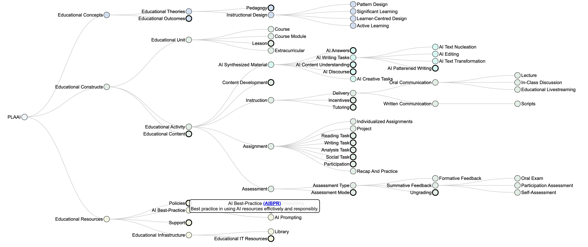

## PLAAI - A Pattern Language for AI-Augmented Instruction

### Reference Pages

The “Pattern Language for AI-Augmented Instruction” (PLAAI) is a structured approach to designing and implementing educational experiences that are enhanced by artificial intelligence. PLAAI focuses on the integration of AI technologies – generative AI Language Models like ChatGPT – into various instructional patterns. Patterns include lectures, discussions, group work and the like; patterns are reusable solutions to common processes in education. By providing practical resources for the integration of AI into the patterns, i.e. explanations, recipes, prompts etc., PLAAI provides a practical approach that is independent  of specific tools, resources, or pedagogies. Following this approach, educators will find ways to personalize instruction, increase engagement, and facilitate richer learning experiences across cognitive, associative, social, and practical domains. Since PLAAI is structured as a “language”, it is natural to create and combine patterns to rich constructs, like modules, courses, or entire programs, and it is straightforward to consider alternatives at every step. The results are assets that are effective, inclusive, and adaptable to learners' needs. 

<figure>
  
  <figcaption>Figure: The PLAAI interactive reference tree (<a href="PLAAI-reference.html">▷</a>), partially expanded. The box at the top is explanatory hover-text over a node.</figcaption>
</figure>

* Click [here](https://stsyl.github.io/PLAAI/PLAAI-reference.html) for the interactive reference tree.
* Read details in the [PLAAI Whitepaper](https://tinyurl.com/PLAAI-wp).
* Find analyses on the [Sentient Syllabus Substack](https://sentientsyllabus.substack.com) site.

----

Boris Steipe, `boris.steipe@utoronto.ca`

<!-- END -->
